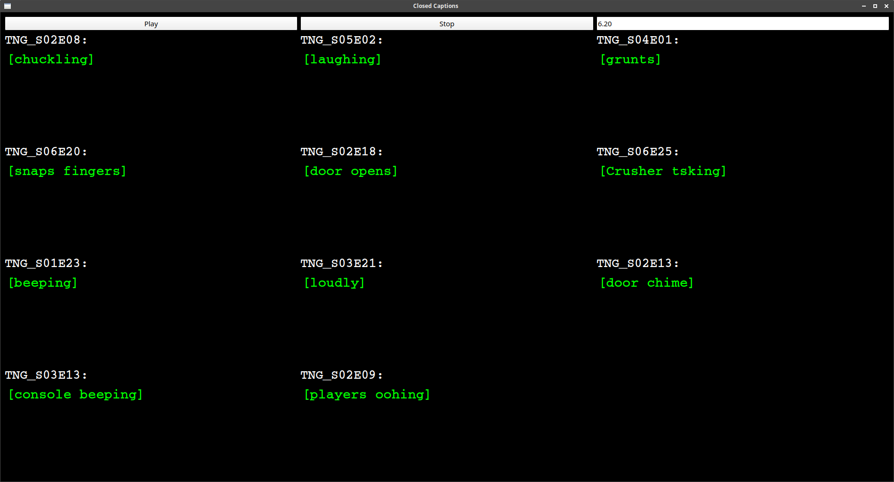

# Closed Captions

---

*Closed Captions* is a conceptual composition tool
based on closed captions of movies and TV series.
Captions can be extracted with their timestamps
from streaming platforms and converted using Matlab scripts.
In the performance, a Python-based
tool is used to play a set of captions,
presented to the musicians on a GUI:

### TNG Version

Depending on the source material for the captions,
*Closed Captions* results in an individual composition.
The TNG version uses the captions of eleven
episodes from *Star Trek - The Next Generation*.
This is by no means a best-off selection, merely
a fast pick:

- Season 01 - Episode 23: "Skin of Evil"
- Season 02 - Episode 08: "A Matter of Honor"
- Season 02 - Episode 09: "The Measure of a Man"
- Season 02 - Episode 13: "Time Squared"
- Season 03 - Episode 13: "Déjà Q"
- Season 02 - Episode 18: "Up the Long Ladder"
- Season 03 - Episode 21: "The Survivors"
- Season 04 - Episode 01: "The Best of Both Worlds, Part II"
- Season 05 - Episode 02: "Darmok"
- Season 06 - Episode 20: "The Chase"
- Season 06 - Episode 25: "Timescape"

# Python3 Dependencies

- pyqt5

# Running Captions

    python3 sub-title_MAIN.py --dir ../PREP/TNG/

# Creating New Caption Files

## Getting Captions From Netflix

For generating new content,
these steps are taken from:

https://github.com/isaacbernat/netflix-to-srt

- use Google Chrome
- open devtools 
        - Cmd + Alt + i.
        - or by pressing F12.
- go to Network tab within dev tools.
- load movie/episode.
- select the subtitle 
- devtools 
    - sort by name 
    - look  a file with ?o= 
    - download as XML

## Converting XML to .sub Files

When extracting captions from subtitles files,
they need to be distinguished from spoken text.

    
THAT WAS

    subtitle_reader_NETFLIX_TNG('TNG_S07E25.xml',70000000,'TNG_S07E25.sub')

