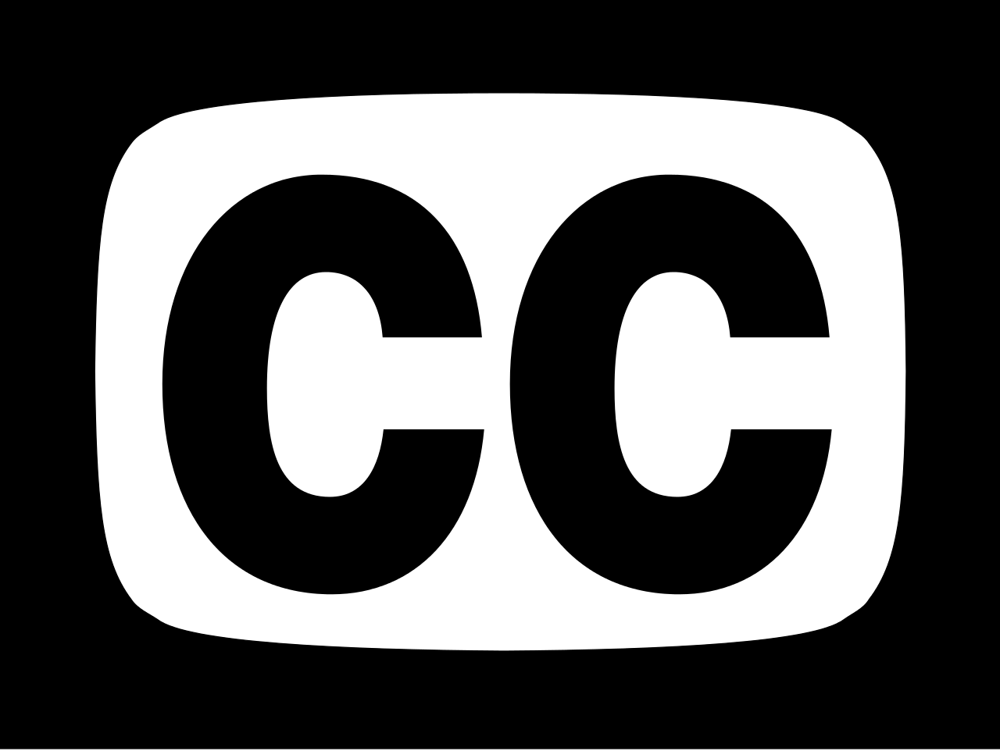

# Closed Captions

---

*Closed Captions* is a conceptual composition
based on closed captions of movies and TV series.
Captions can be extracted with their timestamps
from streaming platforms and converted using Matlab scripts.

In the performance, a Python-based
tool is used to play a set of captions,
presented to the musicians on a GUI.

### TNG Version

The TNG version uses the captions of eleven  
episodes from *Star Trek - The Next Generation*.
This is by no means a best-off selection, merely
a fast pick:

- Season 01 - Episode 23: "Skin of Evil"
- Season 02 - Episode 08: "A Matter of Honor"
- Season 02 - Episode 09: "The Measure of a Man"
- Season 02 - Episode 13: "Time Squared"
- Season 03 - Episode 13: "Déjà Q"
- Season 02 - Episode 18: "Up the Long Ladder"
- Season 03 - Episode 21: "The Survivors"
- Season 04 - Episode 01: "The Best of Both Worlds, Part II"
- Season 05 - Episode 02: "Darmok"
- Season 06 - Episode 20: "The Chase"
- Season 06 - Episode 25: "Timescape"

# Python3 Dependencies

- pyqt5

# Running Captions

``python3 sub-title_MAIN.py --dir ../PREP/TNG/``
